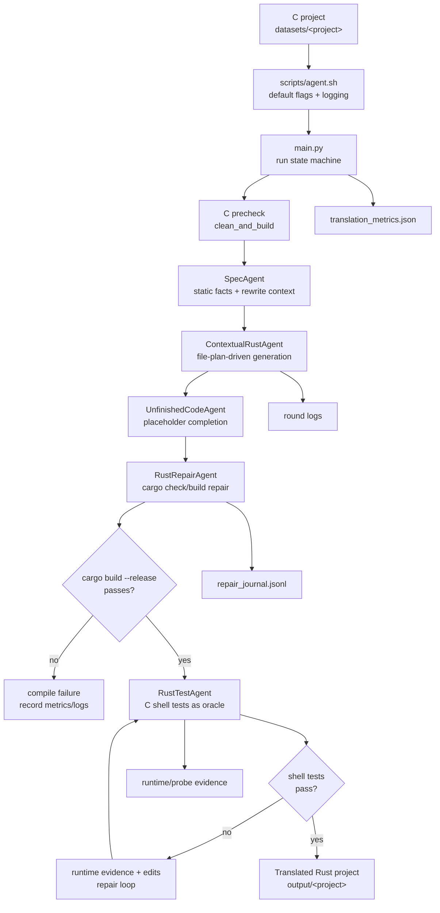
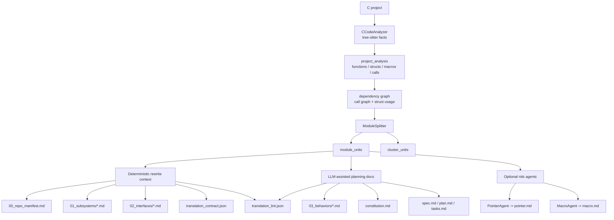
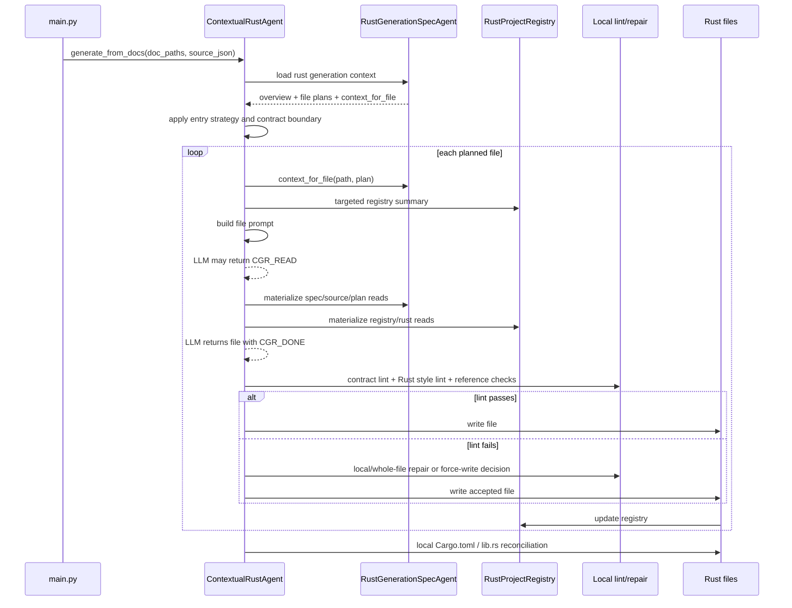
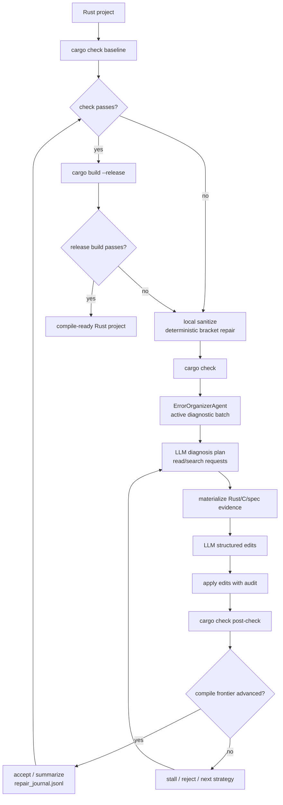
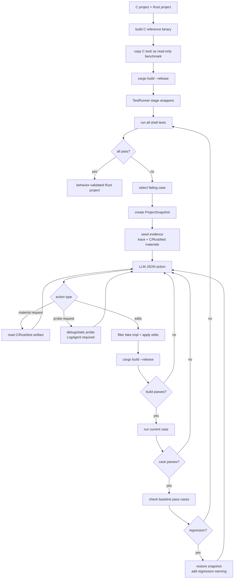
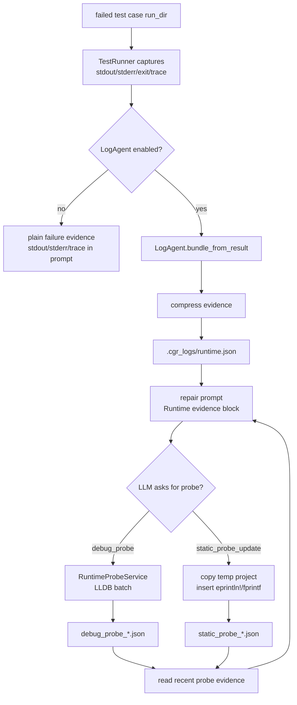
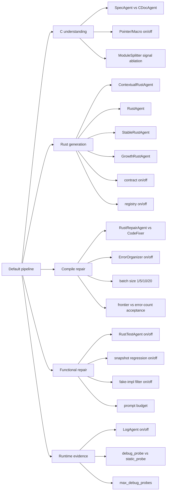

# 系统图与流程图草案

## 用途

本文提供论文可用的系统图草案。图稿聚焦机制关系，不追求实现文件的完整调用图。后续写论文时建议选 3 张主图：

1. 端到端系统总览图。
2. 按需上下文 Rust 生成图。
3. 编译修复和功能测试双闭环图。

其余图可放入附录或系统实现章节。

## 内容结构

- 图 1：端到端迁移流水线。
- 图 2：数据产物和日志流。
- 图 3：`SpecAgent` 文档化理解流程。
- 图 4：`ContextualRustAgent` 按需生成流程。
- 图 5：`RustRepairAgent` 编译前沿修复闭环。
- 图 6：`RustTestAgent` 功能测试修复闭环。
- 图 7：LogAgent 动态 / 静态 probe 取证流程。
- 图 8：实验消融开关图。

每张图后都列出可引用机制、需要补证的数据和局限。

## 图 1：端到端迁移流水线

图注建议：

> The default pipeline validates the C project, derives migration constraints, generates Rust files with demand-driven context, repairs compiler errors, and finally repairs behavioral deviations against the original shell tests.

可引用系统机制：

- `scripts/agent.sh` 默认 flags 固定论文主线。
- `main.py` 在 RustTestAgent 前使用 release build gate。
- `translation_metrics.json`、round logs、repair journal 和 runtime evidence 分别记录全局成本、LLM 调用、编译修复过程和功能测试证据。

需要补证的数据：

- 各阶段成功 / 跳过 / 失败项目数。
- 每阶段平均耗时和 LLM 请求数。
- release build gate 阻止进入 RustTestAgent 的项目比例。

局限：

- 图中 `UnfinishedCodeAgent` 是默认主线中的辅助阶段，不是主要论文贡献。
- `translation_metrics.json` 当前无法直接拆分阶段级成本。

## 图 2：数据产物和日志流

```mermaid
flowchart LR
    subgraph CInput["C input"]
        C1[".c / .h files"]
        C2["Makefile / build files"]
        C3["test/*.sh + fixtures"]
        C4["README / docs"]
    end

    subgraph CDocs["c_docs"]
        D1["docs/rewrite-context"]
        D2["translation_contract.json"]
        D3["specs/*/spec.md"]
        D4["specs/*/plan.md"]
        D5["specs/*/tasks.md"]
        D6["translation_lint.json"]
    end

    subgraph RustOut["Rust project"]
        R1["Cargo.toml"]
        R2["src/*.rs"]
        R3[".cgr_generation_plan.json"]
        R4[".cgr_api_contract.json"]
    end

    subgraph Evidence["Runtime and repair evidence"]
        E1["log/agent-*.log"]
        E2["log/round_logs/*"]
        E3["translation_metrics.json"]
        E4["repair_journal.jsonl"]
        E5[".cgr_logs/runtime.json"]
        E6["debug_probe_*.json"]
        E7["static_probe_*.json"]
    end

    CInput --> CDocs
    CDocs --> RustOut
    RustOut --> Evidence
    CInput --> Evidence
    CDocs --> Evidence
```

图注建议：

> The system makes intermediate evidence persistent: static migration facts become `c_docs`, generated Rust state is summarized in local plan and API contract files, and repair/test loops write process evidence for audit.

可引用系统机制：

- `translation_contract.json` 是机器可读迁移范围边界。
- `.cgr_generation_plan.json` 和 `.cgr_api_contract.json` 记录 Rust 生成计划和已生成 API 摘要。
- `.cgr_logs/` 只存在于测试运行目录，用于 runtime evidence 和 probe evidence。

需要补证的数据：

- 每类产物平均大小。
- `c_docs` 中确定性文档与 LLM 文档的体积占比。
- round log 与修复 / 测试日志的 run 对齐规则。

局限：

- 部分 evidence 是 Markdown 或文本日志，后续统计需要解析。
- `repair_journal.jsonl` 和 `.cgr_logs` 的位置依赖具体运行模式，需要实验脚本统一收集。

## 图 3：SpecAgent 文档化理解流程

图注建议：

> `SpecAgent` converts C syntax facts into both deterministic facts and constrained LLM-written planning documents. The machine-readable contract is the highest-priority boundary for later Rust generation.

可引用系统机制：

- 静态分析层、认知压缩层、执行规划层三层流程。
- `ModuleSplitter` 决定每个模块的 spec/plan/tasks 生成粒度。
- `translation_lint.json` 扫描 scope expansion、未授权依赖、FFI 和 contract 外文件。

需要补证的数据：

- 各文档类型生成轮数和字符数。
- `translation_lint.json` 命中数量与生成越界行为的相关性。
- optional pointer / macro 文档启用后的 prompt 增量和修复收益。

局限：

- `03_behaviors`、`constitution`、`spec/plan/tasks` 仍由 LLM 参与生成，不能视为完全事实源。
- contract 依赖结构体和函数角色抽取准确性。

## 图 4：ContextualRustAgent 按需生成流程

图注建议：

> Each Rust file is generated with a target-specific context slice and a registry summary of already generated APIs. Missing evidence must be requested explicitly through `<CGR_READ>`.

可引用系统机制：

- `RustFilePlan` 绑定目标 Rust 文件、C source files、C functions、owned symbols 和依赖。
- `<CGR_READ>` 支持 spec、source、generated Rust、registry 和 plan。
- registry 在每个文件写入后更新，并用于下一文件的重复定义和跨文件引用检查。
- `Cargo.toml` 和 `src/lib.rs` 使用本地兜底生成。

需要补证的数据：

- 每个文件平均 spec section 数、source snippet 数和 registry summary 长度。
- `<CGR_READ>` 请求成功率与后续 lint finding 变化。
- registry reference finding 与 `cargo check` unresolved / private access 错误重合率。

局限：

- Mermaid sequence 中省略了 `StableRustAgent`、`GrowthRustAgent` 和默认 `RustAgent` baseline。
- registry 不是完整 Rust parser，对 macro、trait impl、泛型和复杂可见性支持有限。

## 图 5：RustRepairAgent 编译前沿修复闭环

图注建议：

> The compiler repair loop separates diagnosis from editing, applies structured edits, and evaluates progress using blocker-aware frontier metrics rather than raw error counts alone.

可引用系统机制：

- 诊断 JSON 和编辑 JSON 分离。
- `ErrorOrganizerAgent` 按错误码和主文件聚类，默认 batch size 为 10。
- `frontier_metrics` 区分 syntax blockers 和 interface blockers。
- `repair_journal.jsonl` 记录 `iteration_result.accept_reason` 和前沿指标。

需要补证的数据：

- 每轮 error count、syntax blockers、interface blockers 曲线。
- `accept_reason` 分布。
- 结构化编辑应用失败率和防 stub 拒绝次数。
- ErrorOrganizer 开关和 batch size 消融。

局限：

- 默认原地修复不能完整回滚被拒候选。
- release build 成功仅代表编译层完成，不代表测试层正确。

## 图 6：RustTestAgent 功能测试修复闭环

图注建议：

> Functional repair treats the original shell tests as an external oracle. A candidate edit is accepted only if it passes the current failing case and preserves previously passing cases.

可引用系统机制：

- `--translate-tests` 被忽略，测试脚本不允许 LLM 修改。
- `BASH_ENV` 映射项目命令到 Rust binary，C binary 通过 `$C_BIN` 或 `<bin>-c` 显式访问。
- `ProjectSnapshot` 和 baseline pass set 控制回归。
- `violates_no_fake_impl()` 拒绝硬编码 expected output 和占位实现。

需要补证的数据：

- 首跑失败用例数、修复成功用例数、回归回滚次数。
- 每个失败用例的材料请求、probe 请求、编辑次数。
- 回归检查覆盖用例数量和耗时。

局限：

- baseline pass set 只覆盖当前已通过用例，不覆盖所有未来行为。
- 如果 shell 测试本身依赖未适配环境，系统会把环境差异当失败证据。

## 图 7：LogAgent 与 probe 取证流程

图注建议：

> LogAgent turns black-box shell failures into structured runtime evidence and exposes controlled diagnostic actions. Probe requests are evidence-gathering rounds and are kept separate from edit rounds.

可引用系统机制：

- `RuntimeEvidenceBundle` 包含 case、exit code、stdout、stderr、trace lines、frames、locals 和 metadata。
- `read_runtime_evidence()` 读取最近 4 个 `debug_probe_*.json` 和最新 1 个 `static_probe_*.json`。
- `debug_probe` 支持 `target = rust|c|both`。
- static probe 只作用于临时副本，并通过 `[CGR_STATIC:<id>]` 标记筛选输出。

需要补证的数据：

- LogAgent 开启 / 关闭的成功率、平均轮数和 token 成本。
- LLDB 不可用、断点未命中、locals 为空、表达式错误等 probe 失败类型。
- static probe 复制、构建和运行开销。

局限：

- 动态 probe 直接运行 binary，不执行完整 shell 脚本。
- static probe 表达式错误会导致临时构建失败。
- probe 证据质量受 release binary debug info 和环境工具链影响。

## 图 8：实验消融开关图

图注建议：

> The implementation exposes most mechanisms as explicit command-line or environment-controlled switches, enabling stage-level ablations.

可引用系统机制：

- `CGR_NO_DEFAULT_FLAGS=1` 可关闭默认 flags 后显式构建 baseline。
- `CGR_USE_POINTER_AGENT`、`CGR_USE_MACRO_AGENT`、`CGR_USE_LOG_AGENT` 控制可选证据。
- `--rust-entry-kind`、`--error-batch-size`、`--rust-test-agent-prompt-budget-chars`、`--log-agent-max-debug-probes` 可作为实验变量。

需要补证的数据：

- 每个开关是否已具备脚本级复现实验命令。
- 各消融是否会改变输出目录命名，避免覆盖结果。
- baseline 之间是否固定同一模型、同一 prompt 配置和同一数据集版本。

局限：

- 部分消融需要代码级开关，例如 registry 完全关闭或 frontier 策略替换，当前不一定已有 CLI。
- 若后续 repair/test 太强，可能掩盖初始生成器差异，需要报告未修复前状态。

## 可引用系统机制

| 图 | 机制 | 建议放置位置 |
| --- | --- | --- |
| 图 1 | 默认端到端闭环 | 方法章节开头 |
| 图 2 | 产物与日志审计链 | 系统实现或实验设置 |
| 图 3 | SpecAgent 文档化理解 | 方法：C program understanding |
| 图 4 | 按需 Rust 生成 | 方法核心图 |
| 图 5 | 编译前沿修复 | 方法：compile repair |
| 图 6 | 功能测试修复 | 方法：functional repair |
| 图 7 | LogAgent 运行时取证 | 系统实现或方法扩展 |
| 图 8 | 消融开关 | 实验设置 |

## 需要补证的数据

- 选择 2 到 3 个真实项目，为图 1 标注实际通过 / 失败路径。
- 从 round logs 和 journal 抽取真实数字，给图 4、图 5、图 6 增加平均轮数。
- 统计每类证据文件是否总能生成，尤其是失败运行中的 `translation_metrics.json`、`repair_journal.jsonl` 和 `.cgr_logs/runtime.json`。
- 为图 8 形成实验命令清单，明确哪些开关已存在，哪些需要代码改造。

## 局限

- 这些图是论文表达图，不是完整调用图；函数名、类名和行号应在正文或附录表格中补充。
- Mermaid 图中的回路省略了异常路径，例如 LLM JSON 解析失败、日志写入失败、测试超时、LLDB 不可用。
- 图 7 中动态 probe 与静态 probe 的“取证轮”语义需要在正文强调，否则读者可能误以为 probe 和 edit 可同时发生。
